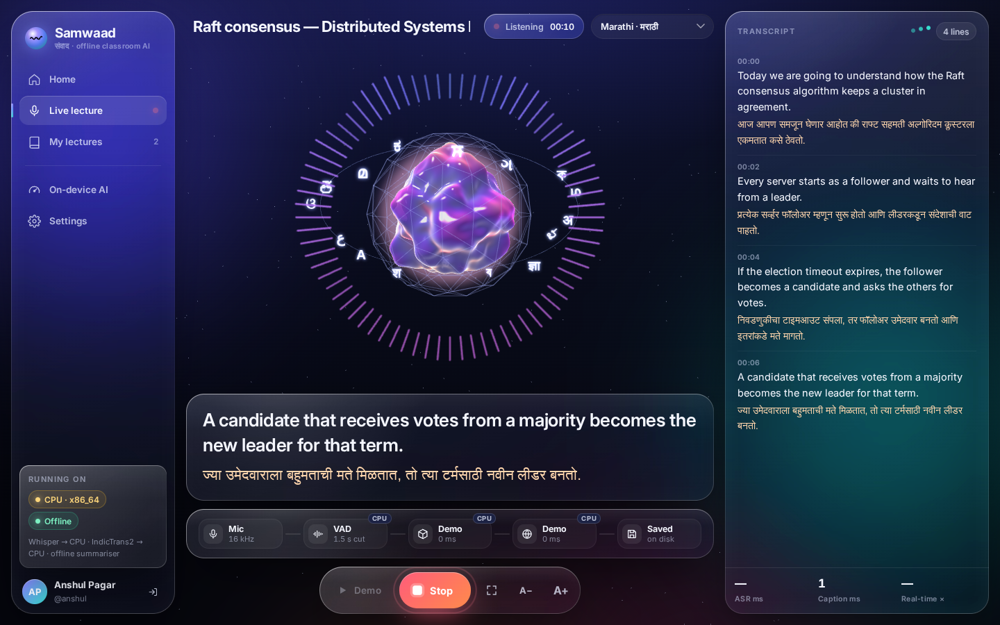
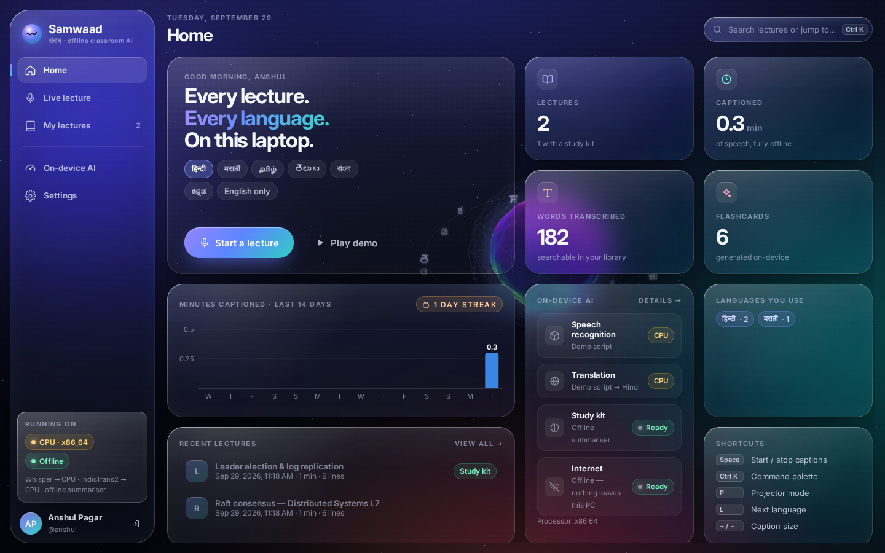
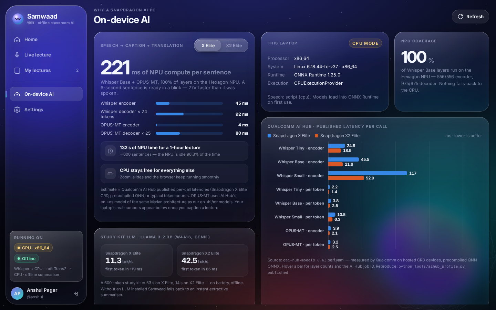
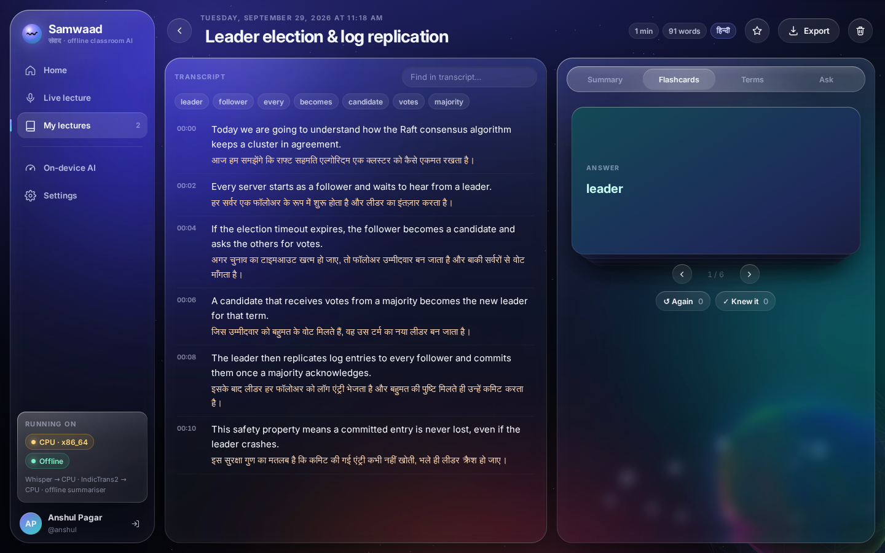
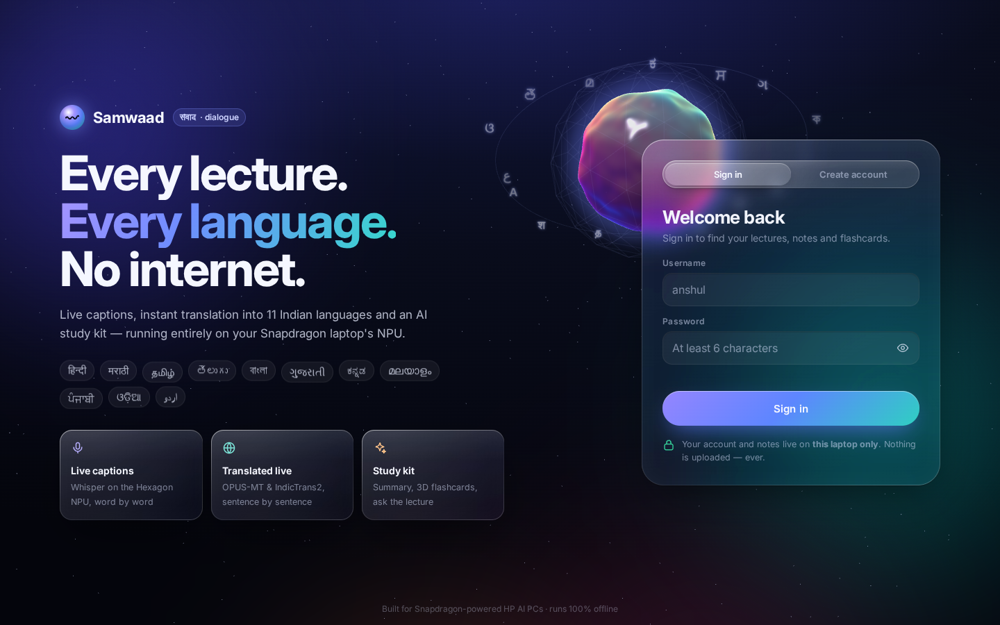

<p align="center"></p>

<h1 align="center">Samwaad · संवाद</h1>
<p align="center"><b>Every lecture. Every language. No internet.</b><br>
Live captions, live translation into 11 Indian languages and an AI study kit —<br>running entirely on the Snapdragon NPU of an HP AI PC.</p>

<p align="center"></p>

---

## Why

- **Language.** Crores of Indian students sit through lectures in English, which isn't the language they think in.
- **Access.** Deaf and hard-of-hearing students rarely get captions. Human captioners are expensive and scarce.
- **Connectivity & privacy.** Cloud captioning needs reliable campus internet, costs money per minute, and ships classroom audio to someone else's servers.

A Snapdragon AI PC fixes all three at once: the Hexagon NPU is fast and frugal enough to run speech recognition and translation **continuously, for a whole day of lectures, on battery, offline.**

## What it does

| | Feature | Model · where it runs |
|---|---|---|
| 🎙️ | **Live captions** from the mic or system audio (class, Zoom, YouTube) — word-by-word, big and readable | Whisper Base · AI Hub precompiled QNN · **NPU** |
| 🌏 | **Live translation**: Hindi, Marathi, Tamil, Telugu, Bengali, Gujarati, Kannada, Malayalam, Punjabi, Odia, Urdu | OPUS-MT (**NPU**) · IndicTrans2 for best quality (CPU) |
| ✦ | **Study kit**: summary, key points, 3D flashcards with a quiz mode, glossary | Llama 3.2 3B via Genie (**NPU**) · offline fallback |
| 💬 | **Ask the lecture**: “What did she say about election timeouts?” | same LLM · retrieval fallback |
| 📽️ | **Projector mode**: giant two-line captions for the classroom screen | — |
| 🗂️ | **Library**: local accounts, full-text search, stars, Markdown export | — |
| 📊 | **On-device AI page**: which model runs where, Qualcomm AI Hub numbers, live latency / CPU / battery | — |
| ♿ | Caption size, high-contrast captions, readable-font mode, reduced motion, screen-reader live region, full keyboard control | — |

## How it uses the Snapdragon NPU

<p align="center"></p>

- **One switch** (`samwaad/runtime.py`): every model opens through ONNX Runtime with the **QNN Execution Provider (HTP)** — the `onnxruntime-qnn` 2.x plugin EP or the 1.x built-in one — and falls back to CPU per model instead of crashing. `runtime.device: auto` means the same build runs on a Snapdragon laptop and on anything else.
- **Speech**: Whisper Base encoder + decoder, **pre-compiled for Snapdragon X by Qualcomm AI Hub** (`qai-hub-models fetch whisper_base --runtime precompiled_qnn_onnx`). Our greedy decoder implements AI Hub's exact I/O contract (static KV cache, 200-token decode window, forced `<|en|><|transcribe|><|notimestamps|>` prompt) in NumPy — no PyTorch at runtime. The log-mel front end is verified identical to Hugging Face's `WhisperFeatureExtractor` (max abs diff 1e-6).
- **Translation**: a **hybrid router** per language — OPUS-MT Marian models compiled for the NPU with AI Hub's own `opus_mt` recipe (`tools/export_opus_mt.py`), and AI4Bharat IndicTrans2 when you pick *Best quality* or a language has no NPU model.
- **Study kit**: Llama 3.2 3B Instruct (w4a16) through Qualcomm Genie, or any local OpenAI-compatible server.

### Numbers (Qualcomm AI Hub, published)

Measured by Qualcomm on hosted Snapdragon devices (`qai-hub-models 0.63` perf data, precompiled QNN ONNX). Full table + job IDs: [`benchmarks/aihub_published.json`](benchmarks/aihub_published.json) · `python tools/aihub_profile.py published`

| Model | Snapdragon X Elite | Snapdragon X2 Elite | Layers on NPU |
|---|---|---|---|
| Whisper Base encoder (30 s window) | 45.5 ms | 21.6 ms | 556 / 556 |
| Whisper Base decoder (per token) | 3.8 ms | 2.5 ms | 975 / 975 |
| OPUS-MT encoder / decoder-per-token (Marian reference) | 3.9 / 3.2 ms | 2.1 / 2.5 ms | 256 / 301 |
| Llama 3.2 3B w4a16 (Genie) | 11.3 tok/s · TTFT 119 ms | 42.5 tok/s · TTFT 85 ms | — |

→ **≈ 221 ms of NPU compute per spoken sentence** (Whisper + OPUS-MT, typical token counts) on X Elite — a 6-second sentence is ready ~27× faster than it was spoken, leaving the NPU idle ~96% of the time and the CPU free for Zoom and slides. The in-app **On-device AI** page shows this estimate next to your laptop's *measured* numbers.

Measure on your own machine: `python tools/benchmark.py models` (every model, CPU vs NPU) and `python tools/benchmark.py pipeline samples/lecture.wav` (caption latency, real-time factor, CPU %, battery drain).

## Install

**Windows (Snapdragon X or x64)** — double-click **`scripts\setup.bat`**. It:
1. finds Python 3.10+ (warns if it's x64 Python on an ARM64 PC — that can't see the NPU),
2. creates `.venv`, installs packages (+ `onnxruntime-qnn` on Snapdragon),
3. downloads the models once (Silero VAD, tokenizers, AI Hub's pre-compiled NPU Whisper),
4. runs the system check and creates Desktop + Start-menu shortcuts, then opens the app.

After that, Samwaad works with Wi-Fi off. Everything else is in-app (Settings → System check).

**Try the whole UI on any laptop, no models:**
```bash
pip install -r requirements.txt
python -m samwaad --demo app        # scripted Raft lecture with real Hindi · Marathi · Tamil lines → Play demo
```

**Manual / developer:**
```bash
python -m venv .venv && .venv/Scripts/activate          # source .venv/bin/activate on Linux/macOS
pip install -r requirements.txt  -r requirements-snapdragon.txt   # (second file on Snapdragon only)
python tools/fetch_models.py      # add --cpu for faster-whisper, --quality for IndicTrans2
python -m samwaad doctor          # NPU, models, mic, LLM — with fixes
python -m samwaad app             # server on 127.0.0.1:8765 + app window
```

NPU translation models (needs a free AI Hub token): `python tools/export_opus_mt.py hi mr dra` · details in [`docs/NPU.md`](docs/NPU.md).
Study-kit LLM: Genie + AI Hub Llama 3.2 3B, or `ollama pull llama3.2:3b` — without one, an instant extractive summariser is used.

**Installer**: `scripts\build_installer.ps1` → PyInstaller one-folder app + Inno Setup `Samwaad-Setup.exe` (ARM64 when built on Snapdragon).

## Screens

| Home | On-device AI |
|---|---|
|  |  |
| **Lecture + study kit** | **Sign in** |
|  |  |

Design: Apple-style *Liquid Glass* — frosted panels whose edges genuinely refract what's behind them (per-panel displacement map → SVG `feDisplacementMap` → `backdrop-filter`, after kube.io's technique), a Three.js voice orb that breathes with the live audio and warms to saffron when someone speaks, a 72-bar spectrum ring, a live pipeline visualiser (Mic → VAD → Whisper → Translate → Saved, each node tagged NPU/CPU), 3D flashcards and tilt cards, and a Ctrl K command palette. Bundled Inter font and Three.js — no CDNs, so it looks the same offline.

## Keyboard

`Space` start/stop · `Ctrl K` command palette · `P` projector mode · `L` next language · `+`/`−` caption size · `←`/`→`/`Space` flashcards

## Project layout

```
samwaad/
  runtime.py      CPU ⇄ NPU switch (onnxruntime-qnn plugin / built-in QNN EP, HTP)
  asr.py          Whisper: AI Hub ONNX greedy decoder (NPU) · faster-whisper (CPU) · demo
  translate.py    Hybrid router: OPUS-MT ONNX (NPU) · IndicTrans2 (CPU)
  vad.py          Silero VAD + sentence segmenter        audio.py   mic / WAV sources
  pipeline.py     threaded live pipeline → events (captions, stages, audio bands, metrics)
  metrics.py      per-stage latency, caption latency, RTF, CPU %, battery drain
  studykit.py     LLM study kit (Genie / local HTTP) + offline fallbacks
  store.py        lectures on disk, per account          auth.py    local accounts
  doctor.py       system check (CLI + in-app)            server.py  FastAPI + WebSocket, 127.0.0.1
  web/            app.html · login.html · css/ · js/ (scene, liquidglass, live, home, library, perf, settings, cmdk)
tools/            fetch_models · export_opus_mt · aihub_profile · benchmark · inspect_onnx
packaging/        PyInstaller spec · Inno Setup installer · launcher
tests/            21 tests incl. NPU decode loops against AI-Hub-shaped ONNX graphs (pytest -q)
docs/             SUBMISSION.md · NPU.md · ARCHITECTURE.md · architecture.svg
```

## Privacy

Binds to `127.0.0.1` only · no network calls after setup · accounts are local (salted PBKDF2-SHA256, HttpOnly SameSite=Strict cookies) · each account sees only its own lectures · lectures are plain files the user can export or delete.

## Credits

Whisper (OpenAI) and Llama 3.2 (Meta) via Qualcomm AI Hub · OPUS-MT (Helsinki-NLP) · IndicTrans2 (AI4Bharat) · Silero VAD · ONNX Runtime + QNN EP · Three.js · Inter. See [THIRD_PARTY_NOTICES.md](THIRD_PARTY_NOTICES.md). Code: MIT.
