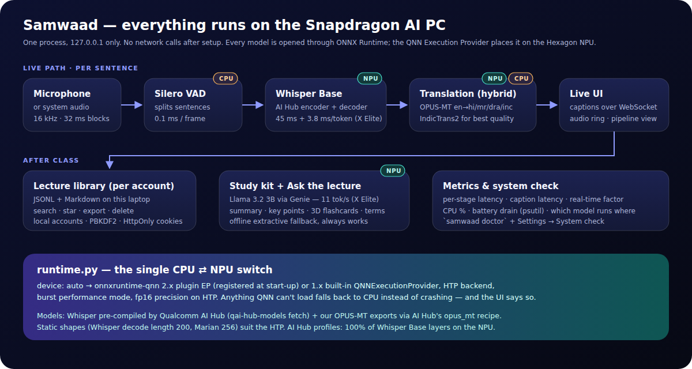

# Architecture

## Processes and threads

One Python process serves everything on `127.0.0.1:8765`:

| thread | work |
|---|---|
| uvicorn event loop | pages, REST API, one WebSocket per open window |
| capture | audio blocks → Silero VAD → sentence segments; streams audio level + 16 spectrum bands (~16/s) |
| inference | per segment: Whisper → caption event → translation → translation event → save line |
| metrics | every 2 s: CPU %, RSS, battery via psutil; rolling latency windows |

A slow translation never delays the next caption, and a broken UI client can never stall the pipeline (listener errors are caught).

## Events (WebSocket, JSON)

`started` · `level {rms, speech, bands[16]}` · `stage {stage: vad|asr|mt|store, state, ms, device}` · `caption {line}` ·
`translation {idx, text, engine}` · `metrics {stages, history, rtf, cpu_avg, battery…}` · `stopped {stats, metrics}` · `error`.
Events go only to windows of the account that started the lecture.

## Where each model runs

| stage | model | device | why |
|---|---|---|---|
| VAD | Silero VAD v5 (2 MB) | CPU | 0.1 ms/frame — NPU dispatch would cost more |
| ASR | Whisper Base, AI Hub precompiled QNN | **NPU** | heaviest per-sentence work; 100 % of layers on HTP |
| MT (fast) | OPUS-MT Marian, AI Hub opus_mt recipe | **NPU** | static-shape seq2seq, ~3–4 ms per call |
| MT (quality) | IndicTrans2 distilled 200M | CPU | all 22 languages, best quality; opt-in |
| Study kit | Llama 3.2 3B w4a16, Genie | **NPU** | after class, not in the live path |

## Latency budget (per ~6 s sentence, X Elite)

| step | time |
|---|---|
| speaker pauses → VAD closes the sentence | 500 ms (configurable `vad.min_silence_ms`) |
| Whisper encoder + ~24 decoder steps | ≈ 137 ms (published per-call latencies) |
| OPUS-MT encoder + ~25 decoder steps | ≈ 84 ms |
| **caption + translation on screen** | **≈ 0.7 s after the pause** |

## Failure behaviour

| problem | what happens |
|---|---|
| QNN EP missing / a model won't load on QNN | that model runs on CPU; badges and the performance page say so |
| no NPU Whisper export | `asr.backend: auto` uses faster-whisper on CPU |
| no translation model for a language | hybrid router → IndicTrans2, else "not installed" (never a wrong language) |
| no LLM | extractive summary, cloze flashcards and retrieval Q&A — instant, always available |
| Whisper hallucinating on silence | VAD gating + hallucination filter |
| microphone busy / missing | clear error toast; Demo mode replays a WAV through the same pipeline |

## Security & privacy

Server binds to loopback only. Accounts: PBKDF2-HMAC-SHA256 (200k iterations, per-user salt); session tokens stored hashed;
HttpOnly + SameSite=Strict cookies; constant-time password check; lecture IDs validated against a strict regex (no path traversal);
accounts can't read each other's lectures (tested).
